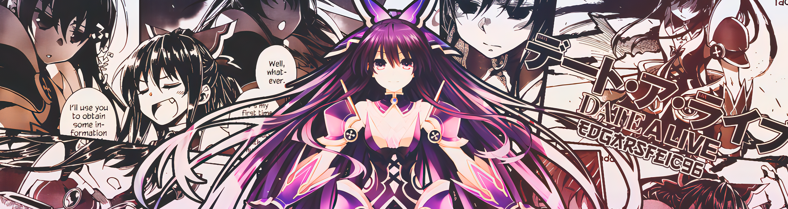

Hi! I'm Edgar, I study Computer Engineering at the Faculty of Engineering (UNAM) <strong>(44.29%)</strong>. I am currently in the sixth semester of university.

I'm interested in desktop/mobile apps, web, and game development.

I use Linux for a few years ago, my main distro is Arch Linux, but I use Fedora as well. Also I use Windows for other tasks and gaming! :)

My favorite programming languages are C# and Typescript :D

### Technologies I use

  
  
  

### Most used Languages

### Stats

### Contributions

